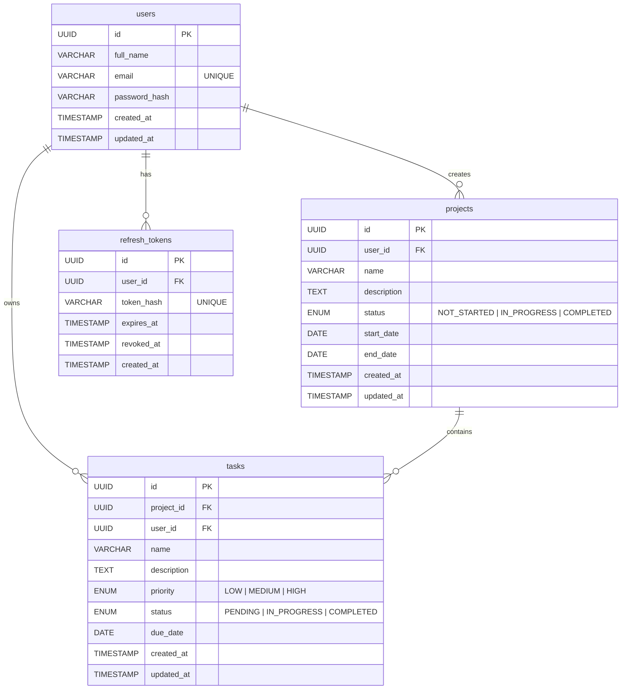

# Database Entity-Relationship (ER) Diagram

The Flowspace database is a relational PostgreSQL database. Below is the Entity-Relationship schema representing how users, projects, tasks, and authentication tokens are connected.

## Relationships

1. **User - Project (1 to Many)**: A User can create many Projects, but a Project belongs to exactly one User.
2. **User - Task (1 to Many)**: A User owns many Tasks (for data isolation).
3. **Project - Task (1 to Many)**: A Project can contain multiple Tasks, and each Task is strictly linked to a specific Project.
4. **User - RefreshToken (1 to Many)**: A User can have multiple active refresh tokens across different devices (e.g., Web App and Mobile App concurrently).
