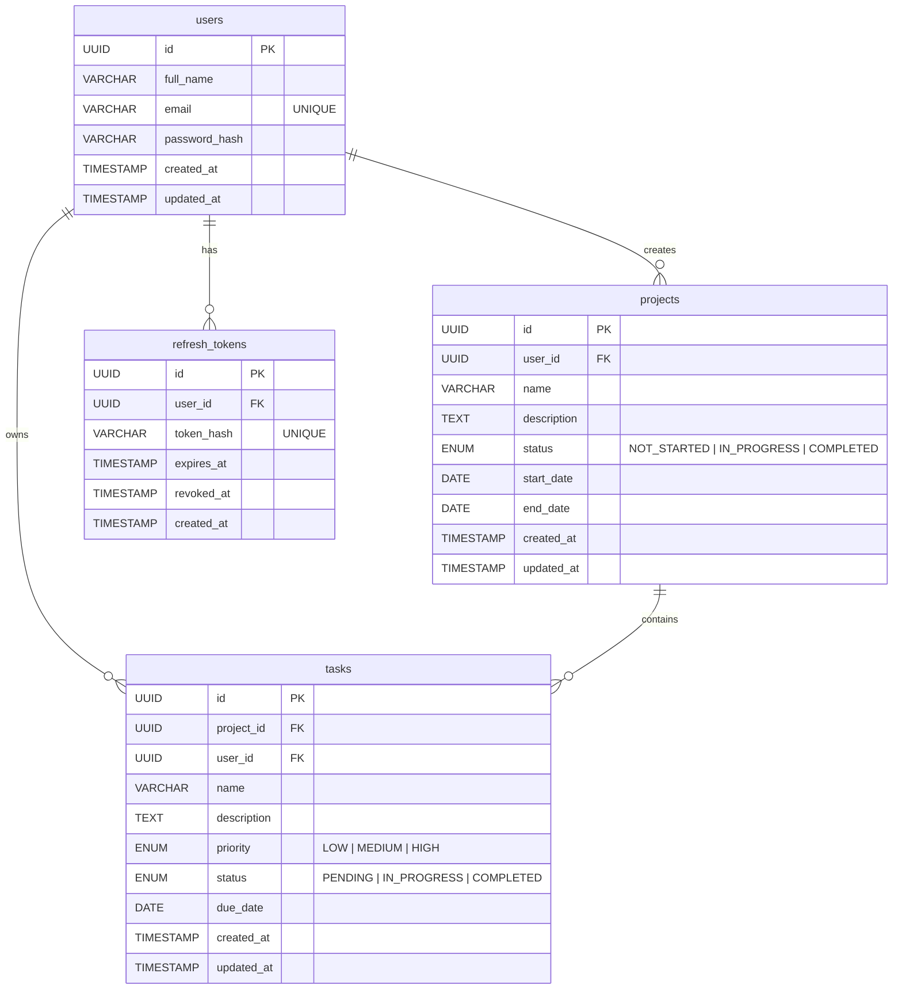

# Flowspace 🌊

Flowspace is a beautiful, full-stack project and task management system. It features a fully responsive React Web Application, a cross-platform Mobile Application (iOS/Android) built with Expo, and a robust Express.js backend powered by Prisma and PostgreSQL.

Live: https://flowspace-six-omega.vercel.app

## 🎓 Submission Details (Full Stack Task)

This repository fulfills all requirements for the Full Stack Task assessment. Below is the quick-reference checklist to easily navigate the project:

### 1. Public GitHub Repository Link
[Flowspace Repository](https://github.com/anirudhg-07/flowspace)

### 2. Database Schema (ER Diagram)
The Flowspace database is a relational PostgreSQL database. Below is the Entity-Relationship schema representing how users, projects, tasks, and authentication tokens are connected.



### 3. API Documentation
All API requests (except login/register) require a valid JWT Bearer token in the `Authorization` header.
Base URL: `/api`

#### Authentication (`/api/auth`)
| Method | Endpoint | Description | Body / Payload |
|--------|----------|-------------|----------------|
| `POST` | `/register` | Register a new user | `{ email, password, fullName }` |
| `POST` | `/login` | Authenticate user | `{ email, password }` |
| `POST` | `/refresh` | Refresh JWT access token | `{ refreshToken }` |
| `POST` | `/logout` | Invalidate refresh token | `{ refreshToken }` |
| `GET`  | `/me` | Get current user profile | *(Requires Auth)* |

#### Dashboard (`/api/dashboard`)
| Method | Endpoint | Description | Body / Payload |
|--------|----------|-------------|----------------|
| `GET`  | `/` | Get aggregate user statistics | *(Requires Auth)* |

#### Projects (`/api/projects`)
| Method | Endpoint | Description | Body / Payload |
|--------|----------|-------------|----------------|
| `GET`  | `/` | Get all projects for user | *(Requires Auth)* |
| `GET`  | `/:id` | Get specific project by ID | *(Requires Auth)* |
| `POST` | `/` | Create a new project | `{ name, description, status, startDate, endDate }` |
| `PUT`  | `/:id` | Update an existing project | `{ name, description, status, startDate, endDate }` |
| `DELETE` | `/:id` | Delete a project and its tasks | *(Requires Auth)* |

#### Tasks (`/api/tasks`)
| Method | Endpoint | Description | Body / Payload |
|--------|----------|-------------|----------------|
| `GET`  | `/` | Get all tasks (supports query filters) | *(Requires Auth)* |
| `GET`  | `/:id` | Get specific task by ID | *(Requires Auth)* |
| `POST` | `/` | Create a new task in a project | `{ projectId, name, description, priority, status, dueDate }` |
| `PUT`  | `/:id` | Update an existing task | `{ name, description, priority, status, dueDate }` |
| `DELETE` | `/:id` | Delete a task | *(Requires Auth)* |


### 5. Deployment URL
- **Web App & Backend**: [https://flowspace-six-omega.vercel.app](https://flowspace-six-omega.vercel.app)

### 6. Mobile App
- **Source Code**: Found in the `/mobile` directory.
- **Expo / EAS Instructions**: You can run `npx expo start` to test locally or use `eas build -p android` to generate an APK.

### 7. Screen Recording
*(To be attached separately by the submitter)*

---

## 🚀 Features

- **Cross-Platform Access**: Manage your projects seamlessly from your browser or your phone.
- **Secure Authentication**: Built-in JWT-based authentication system.
- **Dashboard Analytics**: Get an instant overview of your task progress, upcoming deadlines, and project statuses.
- **Project Management**: Create, edit, and organize projects effortlessly.
- **Task Tracking**: Assign priorities, track statuses, and set deadlines for your tasks.
- **Modern UI**: Designed with a sleek, warm aesthetic using ivory, charcoal, and muted sage.

## 🛠 Tech Stack

### Monorepo Structure
- **Frontend (Web)**: React, Vite, Lucide Icons, Axios
- **Mobile**: React Native, Expo, React Navigation
- **Backend**: Node.js, Express, Prisma ORM, Zod Validation, JWT
- **Database**: PostgreSQL (hosted on Neon)
- **Deployment**: Vercel (Web + Serverless API)

## 💻 Local Development Setup

### Prerequisites
- Node.js (v18 or higher)
- A PostgreSQL Database (e.g., Neon.tech, Supabase, or local)

### 1. Backend Setup
```bash
cd backend
npm install
```
Create a `.env` file in the `/backend` directory:
```env
DATABASE_URL="your_postgresql_database_url"
JWT_SECRET="your_secure_random_string"
PORT=3000
```
Run database migrations and start the server:
```bash
npx prisma db push
npx prisma generate
npm run dev
```

### 2. Web Frontend Setup
```bash
cd web
npm install
```
Start the Vite development server:
```bash
npm run dev
```

### 3. Mobile App Setup
```bash
cd mobile
npm install
```
Start the Expo bundler:
```bash
npx expo start
```

## ☁️ Deployment

Flowspace is configured to be deployed as a unified project on **Vercel**. 
The `vercel.json` file handles routing, serving the static web app on the main domain, and mapping `/api/*` requests to the serverless Express backend.

## 📄 License
This project is open-source and available under the MIT License.
